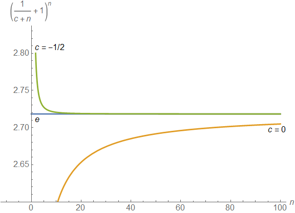

+++
date = '2014-12-27T16:34:42-08:00'
linkTitle = "Euler's constant"
title = "Euler's constant: An improved sequence"
type = "section"
weight = 10
summary = "I found a sequence that converges to Euler's constant faster than Bernoulli's formula."
+++

Remember [Euler's number](https://en.wikipedia.org/wiki/E_(mathematical_constant)), $e=2.71828$... ?  One of the [Bernoulli boys](https://en.wikipedia.org/wiki/Jacob_Bernoulli#Discovery_of_the_mathematical_constant_e) showed that it's the limit of $(1 + 1/n)^n$ as $n$ goes to infinity. But if $n$ goes to infinity then we should be able to add an arbitrary constant $c$ to the denominator without changing the result. So, more generally,

$$e = \lim_{n\rightarrow \infty} \left(1+\frac{1}{n+c}\right)^n.$$

The question that came to my mind then is, what is the "best" constant to choose? It turns out you can show it's $c=-1/2$. In other words, the limit of $(1+1/(n-1/2))^n$ converges to $e$ faster than Bernoulli's formula (or any other $c$). In fact, it's 99% accurate for $n=3$ (versus $n=50$ for Bernoulli).

## Derivation

Here's how I figured it out.  Let's call the $n$-th number in the sequence $E_n$:

$$E_n = \left(1+\frac{1}{n+c}\right)^n.$$

Ideally, we want $E_n=e$ for all $n$.  But then $c$ is no longer a constant.  In fact, we can isolate $c$ in the above equation (with $E_n=e$) to find out how $c$ would depend on $n$:

$$c(n) = \left( e^{1/n} - 1 \right)^{-1} - n.$$

Now we want to know if $c$ converges to a constant as $n\rightarrow\infty$.  But that's tricky.  It becomes much simpler if we take $u=1/n$ and look at what happens as $u\rightarrow 0$.

$$c(u) = \left( e^u - 1 \right)^{-1} - \frac{1}{u}.$$

Then we can expand $c$ as a [Taylor series](https://en.wikipedia.org/wiki/Taylor%20series) around $u=0$ (effectively, a Taylor expansion around $n=\infty$, which is pretty cool!) to get

$$c(u) \approx -\frac{1}{2} + \frac{u}{12} + \cdots$$

So the best choice as a constant for large $n$ is $c=-1/2$ which gives a sequence

$$E_n^{(1)} = \left(1+\frac{1}{n - 1/2}\right)^n = \left(\frac{2 n + 1}{2 n - 1}\right)^n.$$

## Higher order terms

Including higher order terms in the approximation allows to find sequences that converge even faster!  For example, the next order approximation would be $c(n) = -1/2 + 1/(12 n)$, which would give a sequence

$$E_n^{(2)} = \left( \frac{12 n^2 + 6 n + 1}{12 n^2 - 6 n + 1} \right)^n.$$

It's not as pretty an expression but it converges very quickly!  It's already more than 99.8% accurate for $n=1$!  (For $n=1$ the result simplifies to the fraction $E_1^{(2)}=19/7\approx 2.714$.)

## Summary

I found replacing $c=0$ in the sequence $\left(1+\frac{1}{n+c}\right)^n$ with $c=-1/2$ makes it converge to Euler's number much faster as $n\rightarrow \infty$.  Does it matter?  Probably not.  But I sure had a fun afternoon!  :-)

 --- Rik Blok, 2014
